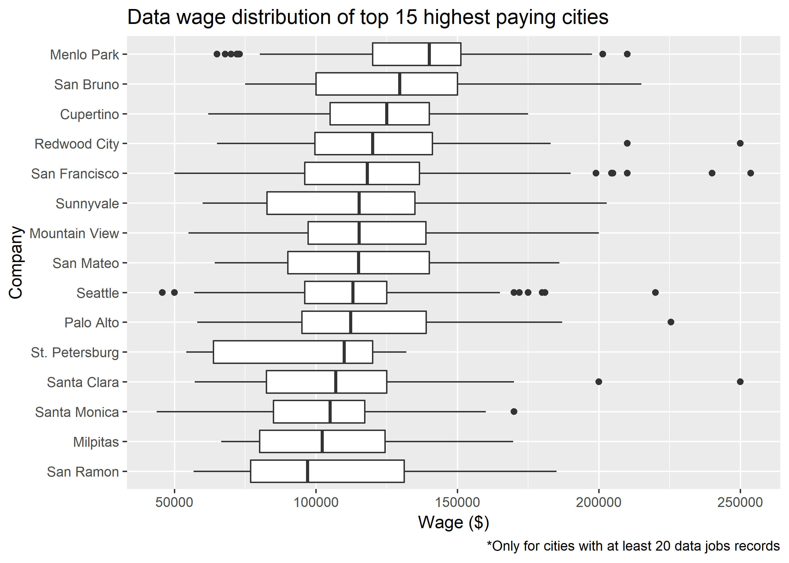
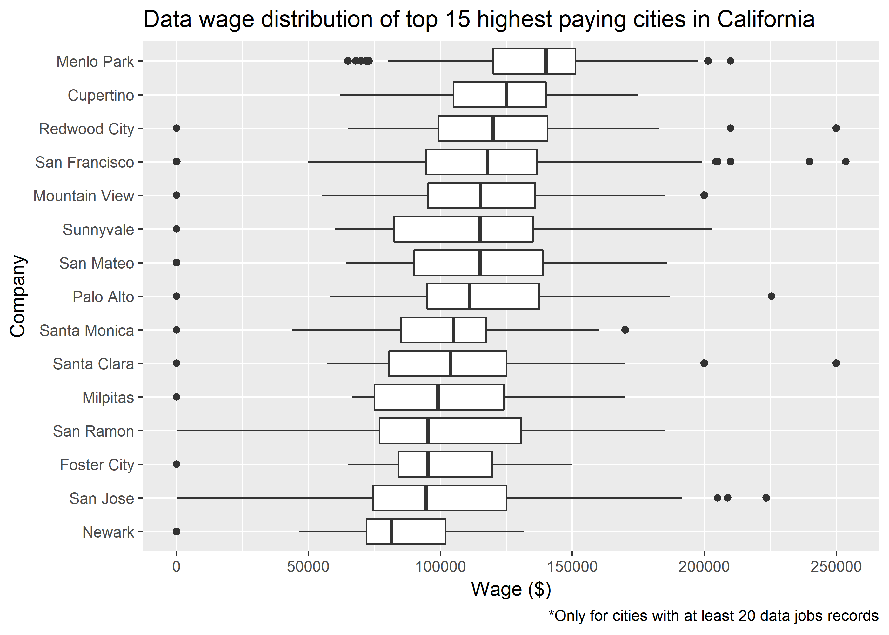

H1B Visualization
================
Chris Oh
2018-11-25

-   [Importing data](#importing-data)
-   [Jobs in data only](#jobs-in-data-only)
-   [Aggregates](#aggregates)
    -   [Overall](#overall)
    -   [Highest paying in data](#highest-paying-in-data)
    -   [By state](#by-state)
    -   [By city](#by-city)
    -   [Within California](#within-california)

``` r
# Libraries
library(tidyverse)
```

    ## Warning: package 'tidyverse' was built under R version 3.5.1

    ## Warning: package 'ggplot2' was built under R version 3.5.1

    ## Warning: package 'tidyr' was built under R version 3.5.1

    ## Warning: package 'readr' was built under R version 3.5.1

    ## Warning: package 'dplyr' was built under R version 3.5.1

``` r
library(readxl)
library(sf)
```

    ## Warning: package 'sf' was built under R version 3.5.1

Importing data
--------------

``` r
# h1b_2017 <- read_xlsx(path_h1b_2017)

state <-
  read_rds(path_state) %>% 
  filter(!STATEFP %in% c("02", "15")) %>% 
  mutate(state_fips = STATEFP %>% as.integer()) %>% 
  st_transform(US_ALBERS)

state_label <- 
  state %>% 
  st_centroid() %>% 
  mutate(
    x = geometry %>% map_dbl(1),
    y = geometry %>% map_dbl(2)
  )
```

checking

Jobs in data only
-----------------

``` r
data_science_17 <- read_rds(path_data_science_17)
data_17 <- read_rds(path_data_17)
```

Aggregates
----------

### Overall

``` r
data_science_17 %>% 
  mutate(wage = as.numeric(WAGE_RATE_OF_PAY_FROM)) %>% 
  ggplot(aes(wage)) +
  geom_histogram(binwidth = 1e4) +
  geom_vline(aes(xintercept = median(wage)), color = "red") +
  labs(
    title = "Wage distribution of jobs in Data Science"
  ) +
  scale_x_continuous(breaks = seq(0, 2.5e5, 5e4))
```


### Highest paying in data

``` r
data_17 %>% 
  mutate(wage = as.numeric(WAGE_RATE_OF_PAY_FROM)) %>% 
  group_by(EMPLOYER_NAME) %>%
  filter(n() >= 7) %>% 
  summarize(median_wage = median(wage, na.rm = TRUE)) %>% 
  top_n(15, median_wage) %>% 
  left_join(data_17, by = "EMPLOYER_NAME") %>% 
  mutate(
    wage = as.numeric(WAGE_RATE_OF_PAY_FROM),
    EMPLOYER_NAME = str_to_title(EMPLOYER_NAME)
  ) %>% 
  ggplot(aes(fct_reorder(EMPLOYER_NAME, -wage), wage)) +
  geom_boxplot() +
  labs(
    title = "Data wage distribution of top 15 highest paying companies",
    y = "Wage ($)",
    x = "Company",
    caption = "*Only for companies with at least 7 data science jobs"
  )
```


### By state

``` r
data_17 %>% 
  mutate(wage = as.numeric(WAGE_RATE_OF_PAY_FROM)) %>% 
  ggplot(aes(fct_reorder(WORKSITE_STATE, -wage), wage)) +
  geom_boxplot() +
  labs(
    title = "Data wage distribution by state",
    y = "Wage ($)",
    x = "States"
  )
```


``` r
data_17 %>%   
  mutate(wage = as.numeric(WAGE_RATE_OF_PAY_FROM) / 1000) %>%
  group_by(WORKSITE_STATE) %>%
  summarize(median_wage = median(wage, na.rm = TRUE)) %>% 
  left_join(state, by = c("WORKSITE_STATE" = "STUSPS")) %>% 
  filter(!is.na(STATEFP)) %>% 
  ggplot() +
  geom_sf(aes(fill = median_wage), color = "#C0C0C0") +
  geom_text(
    aes(x = x, y = y, label = STUSPS),
    color = "#C0C0C0",
    data = state_label,
    size = 3
  ) +
  coord_sf(crs = US_ALBERS, datum = NA) +
  #scale_fill_continuous(breaks = seq(55, 95, 10)) +
  scale_fill_viridis_c(
    option = "inferno",
    labels = str_c(seq(50, 100, 10), "k")
  ) +
  labs(
    title = "2017 Median wage of data jobs in each state",
    x = "",
    y = ""
  ) +
  guides(
    fill = guide_colorbar(
      title = "Median Wage",
      title.position = "top",
      title.hjust = .5,
      title.theme = element_text(size = 7.5, angle = 0),
      label.theme = element_text(size = 6, angle = 0),
      barwidth = 10,
      barheight = .8,
      raster = FALSE,
      #label.position = "bottom",
      #label.vjust = 1,
      #ticks = FALSE,
      # nrow = 1,
      direction = "horizontal"
    )
  ) +
  theme(
    legend.position = c(0.5, 0),
    plot.title = element_text(size = 12, face = "bold", hjust = .5),
    plot.subtitle = element_text(size = 8, hjust = .5),
    rect = element_blank()
  )
```


``` r
state %>% 
  ggplot() +
  geom_sf(fill = "#f1f1f1", color = "#C0C0C0") +
  geom_sf(
    aes(fill = median_wage),
    color = "#C0C0C0",
    data =
      data_science_17 %>%   
      mutate(wage = as.numeric(WAGE_RATE_OF_PAY_FROM) / 1000) %>%
      group_by(WORKSITE_STATE) %>%
      summarize(median_wage = median(wage, na.rm = TRUE)) %>% 
      left_join(state, by = c("WORKSITE_STATE" = "STUSPS"))
  ) +
  geom_text(
    aes(x = x, y = y, label = STUSPS),
    color = "#C0C0C0",
    data = state_label,
    size = 3
  ) +
  coord_sf(crs = US_ALBERS, datum = NA) +
  scale_fill_viridis_c(
    #option = "inferno",
    breaks = seq(50, 120, 10),
    labels = str_c(seq(50, 120, 10), "k")
  ) +
  labs(
    title = "2017 Median wage of data science jobs in each state",
    x = "",
    y = ""
  ) +
  guides(
    fill = guide_colorbar(
      title = "Median Wage",
      title.position = "top",
      title.hjust = .5,
      title.theme = element_text(size = 7.5, angle = 0),
      label.theme = element_text(size = 6, angle = 0),
      barwidth = 10,
      barheight = .8,
      raster = FALSE,
      #label.position = "bottom",
      #label.vjust = 1,
      #ticks = FALSE,
      # nrow = 1,
      direction = "horizontal"
    )
  ) +
  theme(
    legend.position = c(.12, .1),
    plot.title = element_text(size = 12, face = "bold", hjust = .5),
    plot.subtitle = element_text(size = 8, hjust = .5),
    rect = element_blank()
  )
```


### By city

``` r
data_17 %>% 
  mutate(wage = as.numeric(WAGE_RATE_OF_PAY_FROM)) %>% 
  group_by(WORKSITE_CITY) %>%
  filter(n() >= 20) %>% 
  summarize(median_wage = median(wage, na.rm = TRUE)) %>% 
  top_n(15, median_wage) %>% 
  left_join(data_17, by = "WORKSITE_CITY") %>% 
  mutate(
    wage = as.numeric(WAGE_RATE_OF_PAY_FROM),
    EMPLOYER_NAME = str_to_title(WORKSITE_CITY)
  ) %>% 
  filter(wage > 1000) %>% 
  ggplot(aes(fct_reorder(EMPLOYER_NAME, -wage), wage)) +
  geom_boxplot() +
  labs(
    title = "Data wage distribution of top 15 highest paying cities",
    y = "Wage ($)",
    x = "Company",
    caption = "*Only for cities with at least 20 data jobs records"
  )
```



``` r
#Get CALIFORNIA city geoms and then do a geo viz with circles indicating the wage size
```

### Within California

``` r
data_17 %>% 
  filter(WORKSITE_STATE %in% "CA") %>% 
  mutate(wage = as.numeric(WAGE_RATE_OF_PAY_FROM)) %>% 
  group_by(WORKSITE_CITY) %>%
  filter(n() >= 20) %>% 
  summarize(median_wage = median(wage, na.rm = TRUE)) %>% 
  top_n(15, median_wage) %>% 
  left_join(data_17, by = "WORKSITE_CITY") %>% 
  mutate(
    wage = as.numeric(WAGE_RATE_OF_PAY_FROM),
    EMPLOYER_NAME = str_to_title(WORKSITE_CITY)
  ) %>% 
  ggplot(aes(fct_reorder(EMPLOYER_NAME, -wage), wage)) +
  geom_boxplot() +
  labs(
    title = "Data wage distribution of top 15 highest paying cities in California",
    y = "Wage ($)",
    x = "Company",
    caption = "*Only for cities with at least 20 data jobs records"
  )
```


